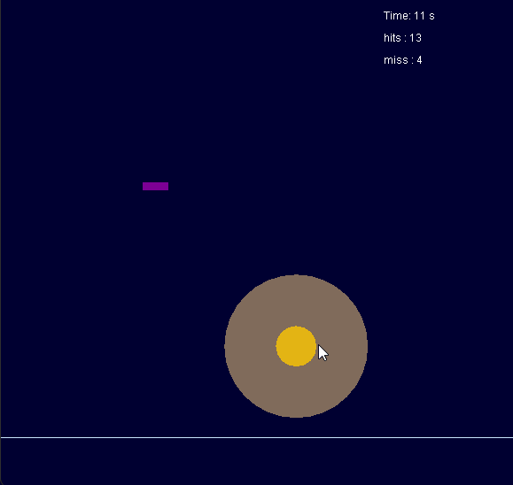

# A mini music game and pad controller design along with plug-ins.
## Final project of Java programming, NCTU ECE, 2017.

## prerequisite:

	JAVA jdk Version: 1.8.0_202 (jdk1.8.0_202)
	/*
		Notice: 
			version at least JAVA8: for java.time.* support
			But cannot be the latest JAVA version: for sun.* is not support anymore
			sun.audio.* is used in this project to play music file (*.wav, *.mid)
	*/

## To Compile & Run:
	copy all the music file (*.wav, *.mid) from "Music_Source" directory to the current directory

	Then, executing following commands:
		rm *.class
		javac -encoding GBK .\GameStart.java
		java GameStart
	
	Click on Game Start button, and enjoy yourself
	//Notice: Change your keyboard input into English one is required

## Game Screen:

	
<!--  -->

## Game Logic:

	Falling Bars:
		Key Q, W, E, R correspoding to 4 tracks of falling bars from left to right respectively.
		Press keys to hit the bars when they fall on to the bottom determination line.
	
	Contrating Circles:
		Click on the center parts of circles to hit them.

## User Settings:

	See file User_Settings.java
	
## Reminder:

	According to the midi file, instances (Falling Bars & Contrating Circles) are generated 
	according to when the note will be played.  Computing when them should appeared on the
	screen so that they will meet the music rhythm when being hit.
	Each key beeps a different sound when pressed so one may enjoy yourself playing with this
	sounds and mixing songs.
	In this progam, there's only one song (mario.mid) is used.  Because the program itself 
	relies on number of music tracks and certain notes to generate instances.  So songs must
	be chosen before put into this game.
	Game main logic are all put in the file: P_2.java in which there're are two lines 
	containing mario. (mario.wav mario.mid) where you can change to your personal musics.
	But these files pair must be of the same origin file.  x.wav is played as the background 
	music and x.mid is used to generate instances.
	Apologize for our unfamiliarity with music playing class.
	This project might be upgraded into using the same music source in the future.
	

